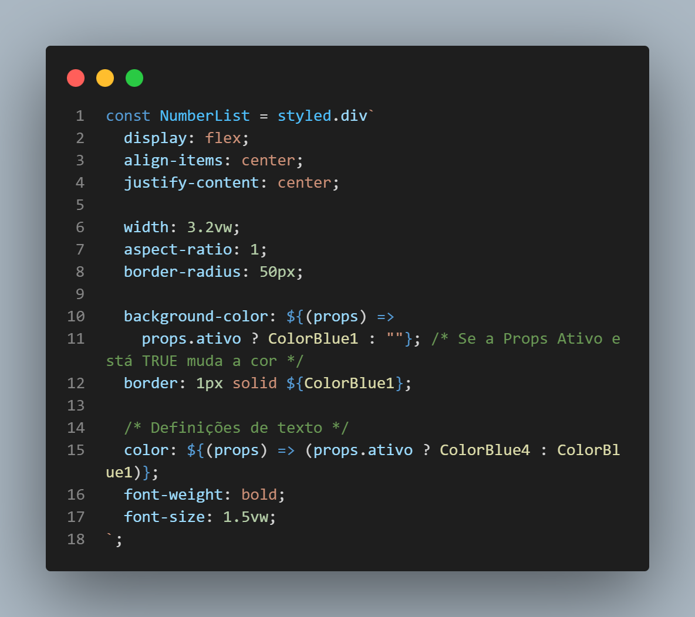
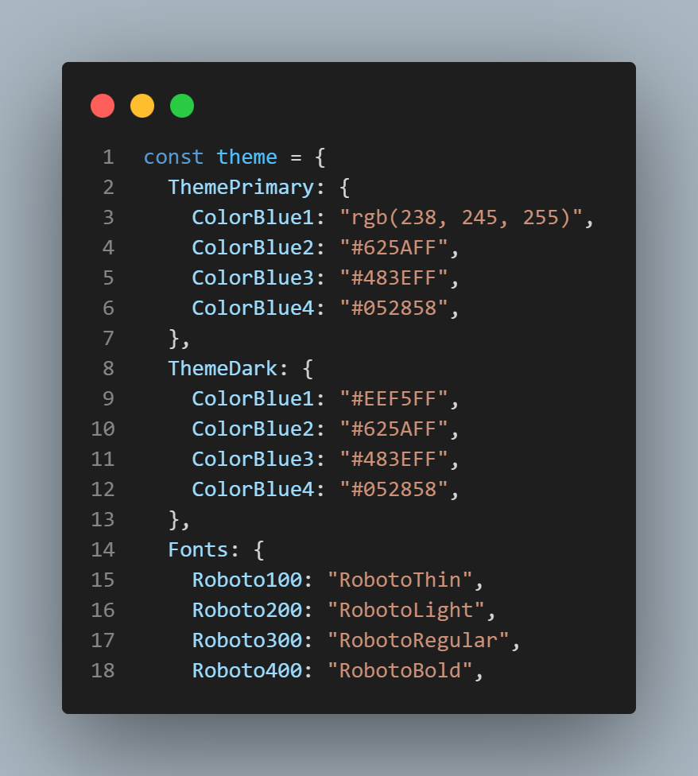

# Overview

Projeto com React JS

Criação de forma em multi steps, pra cadastro. challenge Frontend Mentor
https://www.frontendmentor.io/challenges/multistep-form-YVAnSdqQBJ

# Frontend Mentor - Multi-step form solution

This is a solution to the [Multi-step form challenge on Frontend Mentor](https://www.frontendmentor.io/challenges/multistep-form-YVAnSdqQBJ). Frontend Mentor challenges help you improve your coding skills by building realistic projects.

## Table of contents

- [Overview](#overview)
  - [The challenge](#the-challenge)
  - [Screenshot](#screenshot)
  <!-- - [Links](#links) -->
- [My process](#my-process)
- [Author](#author)
- [Acknowledgments](#acknowledgments)

**Note: Delete this note and update the table of contents based on what sections you keep.**

## Overview

### The challenge

Users should be able to:

- Complete each step of the sequence
- See a summary of their selections on the final step and confirm their order
- View the optimal layout for the interface depending on their device's screen size
- See hover and focus states for all interactive elements on the page

### Screenshot

<!--  -->

SCSS - STYLED COMPONENTS


<!-- ```html
<h1>Some HTML code I'm proud of</h1>
``` -->

```css
color: ${(props) => (props.ativo ? ColorBlue4 : ColorBlue1)};
```

<!-- ```js
const proudOfThisFunc = () => {
  console.log("🎉");
};
``` -->

DESIGN TOKENS


<!--
**Note: Delete this note and the paragraphs above when you add your screenshot. If you prefer not to add a screenshot, feel free to remove this entire section.** -->

### Tecnologias

- [React](https://reactjs.org/)
- [Next.js](https://nextjs.org/) - React framework
- [Styled Components](https://styled-components.com/) - For styles

### Continued development

Use this section to outline areas that you want to continue focusing on in future projects. These could be concepts you're still not completely comfortable with or techniques you found useful that you want to refine and perfect.

**Note: Delete this note and the content within this section and replace with your own plans for continued development.**
